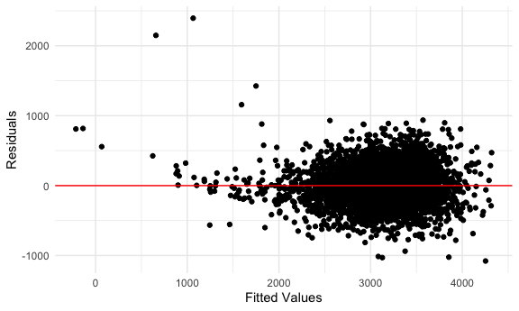

p8105_hw6_zl2746
================
Ze Li
2023-11-27

## Problem 2

``` r
weather_df = 
  rnoaa::meteo_pull_monitors(
    c("USW00094728"),
    var = c("PRCP", "TMIN", "TMAX"), 
    date_min = "2022-01-01",
    date_max = "2022-12-31") |>
  mutate(
    name = recode(id, USW00094728 = "CentralPark_NY"),
    tmin = tmin / 10,
    tmax = tmax / 10) |>
  select(name, id, everything())
```

    ## Registered S3 method overwritten by 'hoardr':
    ##   method           from
    ##   print.cache_info httr

    ## using cached file: /Users/zeze/Library/Caches/org.R-project.R/R/rnoaa/noaa_ghcnd/USW00094728.dly

    ## date created (size, mb): 2023-10-09 17:57:46.959077 (0.343)

    ## file min/max dates: 2021-01-01 / 2023-10-31

``` r
weather_df
```

    ## # A tibble: 365 × 6
    ##    name           id          date        prcp  tmax  tmin
    ##    <chr>          <chr>       <date>     <dbl> <dbl> <dbl>
    ##  1 CentralPark_NY USW00094728 2022-01-01   201  13.3  10  
    ##  2 CentralPark_NY USW00094728 2022-01-02    10  15     2.8
    ##  3 CentralPark_NY USW00094728 2022-01-03     0   2.8  -5.5
    ##  4 CentralPark_NY USW00094728 2022-01-04     0   1.1  -7.1
    ##  5 CentralPark_NY USW00094728 2022-01-05    58   8.3  -0.5
    ##  6 CentralPark_NY USW00094728 2022-01-06     0   5     1.1
    ##  7 CentralPark_NY USW00094728 2022-01-07    97   1.1  -3.8
    ##  8 CentralPark_NY USW00094728 2022-01-08     0  -1    -6.6
    ##  9 CentralPark_NY USW00094728 2022-01-09    25   4.4  -1.6
    ## 10 CentralPark_NY USW00094728 2022-01-10     0   4.4  -4.3
    ## # ℹ 355 more rows

``` r
# Plot simple linear regression with tmax as the response 
# with tmin and prcp as the predictors
weather_df |> 
  ggplot(aes(x = tmin, y = tmax)) + 
  geom_smooth() +
  geom_point()
```

    ## `geom_smooth()` using method = 'loess' and formula = 'y ~ x'


``` r
weather_df |> 
  ggplot(aes(x = prcp, y = tmax)) + 
  geom_smooth() +
  geom_point()
```

    ## `geom_smooth()` using method = 'loess' and formula = 'y ~ x'


``` r
model_slr1 = lm(tmax~tmin, weather_df)
summary(model_slr1)
```

    ## 
    ## Call:
    ## lm(formula = tmax ~ tmin, data = weather_df)
    ## 
    ## Residuals:
    ##     Min      1Q  Median      3Q     Max 
    ## -6.3669 -1.9669  0.0193  1.4636 19.7935 
    ## 
    ## Coefficients:
    ##             Estimate Std. Error t value Pr(>|t|)    
    ## (Intercept)  7.98898    0.21788   36.67   <2e-16 ***
    ## tmin         1.01383    0.01613   62.84   <2e-16 ***
    ## ---
    ## Signif. codes:  0 '***' 0.001 '**' 0.01 '*' 0.05 '.' 0.1 ' ' 1
    ## 
    ## Residual standard error: 2.954 on 363 degrees of freedom
    ## Multiple R-squared:  0.9158, Adjusted R-squared:  0.9156 
    ## F-statistic:  3949 on 1 and 363 DF,  p-value: < 2.2e-16

``` r
model_slr2 = lm(tmax~prcp, weather_df)
summary(model_slr2)
```

    ## 
    ## Call:
    ## lm(formula = tmax ~ prcp, data = weather_df)
    ## 
    ## Residuals:
    ##     Min      1Q  Median      3Q     Max 
    ## -27.144  -8.023   1.056   8.630  18.308 
    ## 
    ## Coefficients:
    ##              Estimate Std. Error t value Pr(>|t|)    
    ## (Intercept) 17.843760   0.581097  30.707   <2e-16 ***
    ## prcp        -0.006444   0.007232  -0.891    0.373    
    ## ---
    ## Signif. codes:  0 '***' 0.001 '**' 0.01 '*' 0.05 '.' 0.1 ' ' 1
    ## 
    ## Residual standard error: 10.17 on 363 degrees of freedom
    ## Multiple R-squared:  0.002183,   Adjusted R-squared:  -0.0005659 
    ## F-statistic: 0.7941 on 1 and 363 DF,  p-value: 0.3735

Use 5000 bootstrap samples and, for each bootstrap sample, produce
estimates of these two quantities. Plot the distribution of your
estimates, and describe these in words.

Using the 5000 bootstrap estimates, identify the 2.5% and 97.5%
quantiles to provide a 95% confidence interval for r̂ 2 and log(β̂ 0∗β̂ 1).

- tmax as the response & tmin as the predictors

``` r
# Start with a lil function
boot_sample = function(df) {
  
  sample_frac(df, replace = TRUE)
  
}

# Draw 5000 samples and analyze them
# Do the lm fit.
boot_results = 
  tibble(strap_number = 1:5000) |> 
  mutate(
    strap_sample = map(strap_number, \(i) boot_sample(weather_df)),
    models = map(strap_sample, \(df) lm(tmax ~ tmin, data = df)),
    results = map(models, broom::tidy)
  ) |> 
  select(strap_number, results) |> 
  unnest(results)

# try to summarize these results – get a bootstrap SE
boot_results |> 
  group_by(term) |> 
  summarize(
    se = sd(estimate)
  )
```

    ## # A tibble: 2 × 2
    ##   term            se
    ##   <chr>        <dbl>
    ## 1 (Intercept) 0.295 
    ## 2 tmin        0.0199

``` r
# look at the distribution
boot_results |> 
  filter(term == "tmin") |> 
  ggplot(aes(x = estimate)) + 
  geom_density()
```


``` r
# construct a CI
boot_results |> 
  group_by(term) |> 
  summarize(
    ci_lower = quantile(estimate, 0.025),
    ci_upper = quantile(estimate, 0.975)
  )
```

    ## # A tibble: 2 × 3
    ##   term        ci_lower ci_upper
    ##   <chr>          <dbl>    <dbl>
    ## 1 (Intercept)    7.45      8.62
    ## 2 tmin           0.972     1.05

- tmax as the response & prcp as the predictors

``` r
# Draw 5000 samples and analyze them
# Do the lm fit.
boot_results2 = 
  tibble(strap_number = 1:5000) |> 
  mutate(
    strap_sample = map(strap_number, \(i) boot_sample(weather_df)),
    models = map(strap_sample, \(df) lm(tmax ~ tmin + prcp, data = df)),
    results = map(models, broom::tidy)
  ) |> 
  select(strap_number, results) |> 
  unnest(results)

# try to summarize these results – get a bootstrap SE
boot_results2 |> 
  group_by(term) |> 
  summarize(
    se = sd(estimate)
  )
```

    ## # A tibble: 3 × 2
    ##   term             se
    ##   <chr>         <dbl>
    ## 1 (Intercept) 0.231  
    ## 2 prcp        0.00472
    ## 3 tmin        0.0190

``` r
# look at the distribution
boot_results2 |> 
  filter(term == "tmin") |> 
  ggplot(aes(x = estimate)) + 
  geom_density()
```



``` r
# construct a CI
boot_results2 |> 
  group_by(term) |> 
  summarize(
    ci_lower = quantile(estimate, 0.025),
    ci_upper = quantile(estimate, 0.975)
  )
```

    ## # A tibble: 3 × 3
    ##   term        ci_lower ci_upper
    ##   <chr>          <dbl>    <dbl>
    ## 1 (Intercept)  7.61     8.51   
    ## 2 prcp        -0.00932  0.00820
    ## 3 tmin         0.976    1.05
