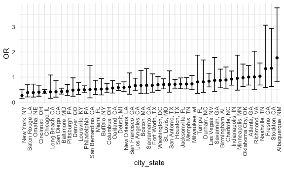
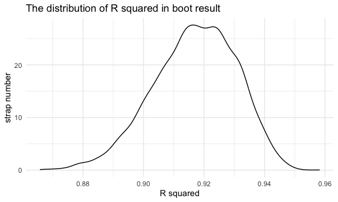

p8105_hw6_zl2746
================
Ze Li
2023-11-27

## Problem 1

For the city of Baltimore, MD, use the glm function to fit a logistic
regression with resolved vs unresolved as the outcome and victim age,
sex and race as predictors. Save the output of glm as an R object; apply
the broom::tidy to this object; and obtain the estimate and confidence
interval of the adjusted odds ratio for solving homicides comparing male
victims to female victims keeping all other variables fixed.

``` r
# Load and clean data
homicide_df = 
  read_csv("homicide-data.csv", na = c("", "NA", "Unknown")) |>
  unite(city_state,c(city,state),sep = ', ') |>
  mutate(resolution = case_when(
      disposition == "Closed without arrest" ~ 0,
      disposition == "Open/No arrest"        ~ 0,
      disposition == "Closed by arrest"      ~ 1),
      city_state = ifelse(city_state == "Tulsa, AL", "Tulsa, OK", city_state),
         victim_age = as.numeric(victim_age)) |>
  filter(!city_state %in% c("Dallas, TX", "Phoenix, AZ", "Kansas City, MO", "Tulsa, OK")) |>
  filter(victim_race %in% c("White", "Black")) |>
  select(city_state, resolution, victim_age, victim_sex, victim_race)
```

    ## Rows: 52179 Columns: 12
    ## ── Column specification ────────────────────────────────────────────────────────
    ## Delimiter: ","
    ## chr (8): uid, victim_last, victim_first, victim_race, victim_sex, city, stat...
    ## dbl (4): reported_date, victim_age, lat, lon
    ## 
    ## ℹ Use `spec()` to retrieve the full column specification for this data.
    ## ℹ Specify the column types or set `show_col_types = FALSE` to quiet this message.

``` r
head(homicide_df)
```

    ## # A tibble: 6 × 5
    ##   city_state      resolution victim_age victim_sex victim_race
    ##   <chr>                <dbl>      <dbl> <chr>      <chr>      
    ## 1 Albuquerque, NM          0         15 Female     White      
    ## 2 Albuquerque, NM          0         72 Female     White      
    ## 3 Albuquerque, NM          0         91 Female     White      
    ## 4 Albuquerque, NM          0         56 Male       White      
    ## 5 Albuquerque, NM          0         NA Male       White      
    ## 6 Albuquerque, NM          1         43 Female     White

Next we fit a logistic regression model using only data from Baltimore,
MD. We model `resolved` as the outcome and `victim_age`, `victim_sex`,
and `victim_race` as predictors. We save the output as `baltimore_glm`
so that we can apply `broom::tidy` to this object and obtain the
estimate and confidence interval of the adjusted odds ratio for solving
homicides comparing non-white victims to white victims.

``` r
baltimore_glm = 
  filter(homicide_df, city_state == "Baltimore, MD") |> 
  glm(resolution ~ victim_age + victim_sex + victim_race, family = binomial(), data = _)

baltimore_glm |> 
  broom::tidy() |> 
  mutate(
    OR = exp(estimate), 
    OR_CI_upper = exp(estimate + 1.96 * std.error),
    OR_CI_lower = exp(estimate - 1.96 * std.error)) |> 
  filter(term == "victim_sexMale") |> 
  select(OR, OR_CI_lower, OR_CI_upper) |>
  knitr::kable(digits = 3)
```

|    OR | OR_CI_lower | OR_CI_upper |
|------:|------------:|------------:|
| 0.426 |       0.325 |       0.558 |

Below, by incorporating `nest()`, `map()`, and `unnest()` into the
preceding Baltimore-specific code, we fit a model for each of the
cities, and extract the adjusted odds ratio (and CI) for solving
homicides comparing non-white victims to white victims. We show the
first 5 rows of the resulting dataframe of model results.

``` r
model_results = 
  homicide_df |> 
  nest(data = -city_state) |> 
  mutate(
    models = map(data, \(df) glm(resolution ~ victim_age + victim_sex + victim_race, 
                             family = binomial(), data = df)),
    tidy_models = map(models, broom::tidy)) |> 
  select(-models, -data) |> 
  unnest(cols = tidy_models) |> 
  mutate(
    OR = exp(estimate), 
    OR_CI_upper = exp(estimate + 1.96 * std.error),
    OR_CI_lower = exp(estimate - 1.96 * std.error)) |> 
  filter(term == "victim_sexMale") |> 
  select(city_state, OR, OR_CI_lower, OR_CI_upper)

model_results |>
  slice(1:5) |> 
  knitr::kable(digits = 3)
```

| city_state      |    OR | OR_CI_lower | OR_CI_upper |
|:----------------|------:|------------:|------------:|
| Albuquerque, NM | 1.767 |       0.831 |       3.761 |
| Atlanta, GA     | 1.000 |       0.684 |       1.463 |
| Baltimore, MD   | 0.426 |       0.325 |       0.558 |
| Baton Rouge, LA | 0.381 |       0.209 |       0.695 |
| Birmingham, AL  | 0.870 |       0.574 |       1.318 |

Below we generate a plot of the estimated ORs and CIs for each city,
ordered by magnitude of the OR from smallest to largest. From this plot
we see that most cities have odds ratios that are smaller than 1,
suggesting that crimes with male victims have smaller odds of resolution
compared to crimes with female victims after adjusting for victim age
and race. This disparity is strongest in New yrok. In roughly half of
these cities, confidence intervals are narrow and do not contain 1,
suggesting a significant difference in resolution rates by sex after
adjustment for victim age and race.

``` r
model_results |> 
  mutate(city_state = fct_reorder(city_state, OR)) |> 
  ggplot(aes(x = city_state, y = OR)) + 
  geom_point() + 
  geom_errorbar(aes(ymin = OR_CI_lower, ymax = OR_CI_upper)) + 
  theme(axis.text.x = element_text(angle = 90, hjust = 1))
```



## Problem 2

``` r
# Load data
weather_df = 
  rnoaa::meteo_pull_monitors(
    c("USW00094728"),
    var = c("PRCP", "TMIN", "TMAX"), 
    date_min = "2022-01-01",
    date_max = "2022-12-31") |>
  mutate(
    name = recode(id, USW00094728 = "CentralPark_NY"),
    tmin = tmin / 10,
    tmax = tmax / 10) |>
  select(name, id, everything())
```

    ## using cached file: /Users/zeze/Library/Caches/org.R-project.R/R/rnoaa/noaa_ghcnd/USW00094728.dly

    ## date created (size, mb): 2023-10-09 17:57:46.959077 (0.343)

    ## file min/max dates: 2021-01-01 / 2023-10-31

``` r
weather_df
```

    ## # A tibble: 365 × 6
    ##    name           id          date        prcp  tmax  tmin
    ##    <chr>          <chr>       <date>     <dbl> <dbl> <dbl>
    ##  1 CentralPark_NY USW00094728 2022-01-01   201  13.3  10  
    ##  2 CentralPark_NY USW00094728 2022-01-02    10  15     2.8
    ##  3 CentralPark_NY USW00094728 2022-01-03     0   2.8  -5.5
    ##  4 CentralPark_NY USW00094728 2022-01-04     0   1.1  -7.1
    ##  5 CentralPark_NY USW00094728 2022-01-05    58   8.3  -0.5
    ##  6 CentralPark_NY USW00094728 2022-01-06     0   5     1.1
    ##  7 CentralPark_NY USW00094728 2022-01-07    97   1.1  -3.8
    ##  8 CentralPark_NY USW00094728 2022-01-08     0  -1    -6.6
    ##  9 CentralPark_NY USW00094728 2022-01-09    25   4.4  -1.6
    ## 10 CentralPark_NY USW00094728 2022-01-10     0   4.4  -4.3
    ## # ℹ 355 more rows

Use 5000 bootstrap samples and, for each bootstrap sample, produce
estimates of these two quantities. Plot the distribution of your
estimates, and describe these in words.

- tmax as the response & tmin and prcp as the predictors

``` r
# Start with a lil function
boot_sample = function(df) {
  
  sample_frac(df, replace = TRUE)
  
}

# Draw 5000 samples and analyze them
# Do the lm fit.
boot_results = 
  tibble(strap_number = 1:5000) |> 
  mutate(
    strap_sample = map(strap_number, \(i) boot_sample(weather_df)),
    models = map(strap_sample, \(df) lm(tmax ~ tmin + prcp, data = df)),
    results = map(models, broom::tidy),
    r_squared = map_dbl(models, \(model) summary(model)$r.squared)
  ) |> 
  select(strap_number, results,r_squared) |> 
  unnest(results)

# try to summarize these results – get log(beta1_hat * beta2_hat) & r_squared
boot_results2 = 
  boot_results |>
  group_by(term) |> 
  select(strap_number, term, estimate, r_squared) |>
  pivot_wider(
    names_from = term,
    values_from = estimate
  ) |> 
  mutate(
    log_beta = log(tmin * prcp)
  )
boot_results2
```

    ## # A tibble: 5,000 × 6
    ##    strap_number r_squared `(Intercept)`  tmin      prcp log_beta
    ##           <int>     <dbl>         <dbl> <dbl>     <dbl>    <dbl>
    ##  1            1     0.905          8.01 1.02  -0.00372    NaN   
    ##  2            2     0.936          7.74 1.05  -0.00793    NaN   
    ##  3            3     0.911          8.02 0.998  0.00506     -5.29
    ##  4            4     0.898          8.33 0.987 -0.000612   NaN   
    ##  5            5     0.905          8.49 0.976  0.000237    -8.37
    ##  6            6     0.897          8.35 0.999  0.000600    -7.42
    ##  7            7     0.909          8.28 1.01  -0.00197    NaN   
    ##  8            8     0.888          8.17 0.975  0.00774     -4.89
    ##  9            9     0.906          8.15 1.01   0.00519     -5.25
    ## 10           10     0.932          8.18 1.03  -0.00663    NaN   
    ## # ℹ 4,990 more rows

``` r
# look at the distribution of tmin
boot_results2 |> 
  ggplot(aes(x = tmin)) + 
  geom_density() +
  xlab("tmin estimate") +
  ylab("strap number") +
  ggtitle("The distribution of tmin in boot result")
```


``` r
ggsave("The distribution of tmin in boot result for problem 2.jpg")
```

    ## Saving 6 x 3.6 in image

``` r
# look at the distribution of prcp
boot_results2 |> 
  ggplot(aes(x = prcp)) + 
  geom_density() +
  xlab("prcp estimate") +
  ylab("strap number") +
  ggtitle("The distribution of prcp in boot result")
```


``` r
ggsave("The distribution of prcp in boot result for problem 2.jpg")
```

    ## Saving 6 x 3.6 in image

``` r
# look at the distribution of log(beta1*beta2)
boot_results2 |> 
  ggplot(aes(x = log_beta)) + 
  geom_density() +
  xlab("log(beta1*beta2)") +
  ylab("strap number") +
  ggtitle("The distribution of log(beta1*beta2) in boot result")
```


``` r
ggsave("The distribution of log(beta1*beta2) in boot result for problem 2.jpg")
```

    ## Saving 6 x 3.6 in image

``` r
# look at the distribution of r squared
boot_results2 |> 
  ggplot(aes(x = r_squared)) + 
  geom_density() +
  xlab("R squared") +
  ylab("strap number") +
  ggtitle("The distribution of R squared in boot result")
```



``` r
ggsave("The distribution of R squared in boot result for problem 2.jpg")
```

    ## Saving 6 x 3.6 in image

**The distribution for tmin is symmetric and unimodal, centered around
1.00, with estimates ranging roughly from 0.95 to 1.05. This suggests
that the bootstrap method produced a reliable estimate for tmin with a
narrow spread and precision.**

**The distribution for prcp is bimodal, indicating two different modes
of behavior or relationships between prcp and tmax within the dataset.
The presence of bimodality in the bootstrap distribution could be
indicative of a non-linear relationship**

**The distribution for log(beta1 \* beta2) is sharply peaked and
asymmetric, which is left skewed. The long tail stretching toward larger
negative values shows that there are a few bootstrap samples where the
product of the coefficients is very small.**

**The distribution for R squared is a unimodal, nearly symmetrical
shape. It is centered around a value slightly less than 0.925,
suggesting that most of the bootstrap models have a high proportion of
variance explained. The peak’s sharpness indicates consistency across
bootstrap samples.**

Using the 5000 bootstrap estimates, identify the 2.5% and 97.5%
quantiles to provide a 95% confidence interval for r̂ 2 and log(β̂ 1 \* β̂
2).

``` r
# The fraction of valid log
valid_log =
  boot_results2 |> 
  drop_na() 
fraction = nrow(valid_log)/5000
fraction
```

    ## [1] 0.3356

``` r
# construct a CI for log(beta1*beta2)
boot_results2 |> 
  drop_na() |> 
  summarize(
    ci_lower = quantile(log_beta, 0.025),
    ci_upper = quantile(log_beta, 0.975),
  )
```

    ## # A tibble: 1 × 2
    ##   ci_lower ci_upper
    ##      <dbl>    <dbl>
    ## 1    -9.10    -4.57

``` r
# construct a CI for r squared
boot_results2 |> 
  summarize(
    ci_lower = quantile(r_squared, 0.025),
    ci_upper = quantile(r_squared, 0.975)
  )
```

    ## # A tibble: 1 × 2
    ##   ci_lower ci_upper
    ##      <dbl>    <dbl>
    ## 1    0.888    0.941

**There is only 0.3356 of dataset can be used for log(beta1 \* beta2).**

## Problem 3

``` r
# Load and clean the data for regression analysis
birthweight <- read_csv("birthweight.csv") |>
  mutate(
    babysex = recode(babysex, "1" = "male", "2" = "female"),
    frace = recode(frace, "1" = "White", "2" = "Black", "3" = "Asian", "4" = "Puerto Rican", "8" = "Other", "9" = "Unknown"),
    mrace = recode(mrace, "1" = "White", "2" = "Black", "3" = "Asian", "4" = "Puerto Rican", "8" = "Other"),
    malform = recode(malform, "0" = "absent", "1" = "present")
  ) |>
  drop_na()
```

    ## Rows: 4342 Columns: 20
    ## ── Column specification ────────────────────────────────────────────────────────
    ## Delimiter: ","
    ## dbl (20): babysex, bhead, blength, bwt, delwt, fincome, frace, gaweeks, malf...
    ## 
    ## ℹ Use `spec()` to retrieve the full column specification for this data.
    ## ℹ Specify the column types or set `show_col_types = FALSE` to quiet this message.

``` r
# negative wtgain?
```

Propose a regression model for birthweight. This model may be based on a
hypothesized structure for the factors that underly birthweight, on a
data-driven model-building process, or a combination of the two.
Describe your modeling process and show a plot of model residuals
against fitted values – use add_predictions and add_residuals in making
this plot.

``` r
# Propose a regression model for birthweight
model <- lm(bwt ~ gaweeks + ppbmi + blength + bhead + smoken + wtgain + babysex + frace + mrace, 
            data = birthweight)
summary(model)
```

    ## 
    ## Call:
    ## lm(formula = bwt ~ gaweeks + ppbmi + blength + bhead + smoken + 
    ##     wtgain + babysex + frace + mrace, data = birthweight)
    ## 
    ## Residuals:
    ##      Min       1Q   Median       3Q      Max 
    ## -1078.62  -186.86    -4.04   178.99  2394.57 
    ## 
    ## Coefficients:
    ##                     Estimate Std. Error t value Pr(>|t|)    
    ## (Intercept)       -5807.0967   107.5992 -53.970  < 2e-16 ***
    ## gaweeks              11.2032     1.4677   7.633 2.80e-14 ***
    ## ppbmi                 7.0895     1.3396   5.292 1.27e-07 ***
    ## blength              76.4581     2.0204  37.844  < 2e-16 ***
    ## bhead               132.2350     3.4683  38.126  < 2e-16 ***
    ## smoken               -4.6531     0.5896  -7.892 3.75e-15 ***
    ## wtgain                4.0902     0.3949  10.357  < 2e-16 ***
    ## babysexmale         -31.6289     8.5081  -3.717 0.000204 ***
    ## fraceBlack           -2.9663    79.3153  -0.037 0.970169    
    ## fraceOther          -34.7011    98.1790  -0.353 0.723771    
    ## fracePuerto Rican   -73.1480    78.9930  -0.926 0.354494    
    ## fraceWhite          -21.3772    69.7263  -0.307 0.759172    
    ## mraceBlack          -52.3828    81.3015  -0.644 0.519413    
    ## mracePuerto Rican    22.3725    81.3107   0.275 0.783215    
    ## mraceWhite          113.7748    72.2367   1.575 0.115323    
    ## ---
    ## Signif. codes:  0 '***' 0.001 '**' 0.01 '*' 0.05 '.' 0.1 ' ' 1
    ## 
    ## Residual standard error: 274.4 on 4327 degrees of freedom
    ## Multiple R-squared:  0.7139, Adjusted R-squared:  0.713 
    ## F-statistic: 771.2 on 14 and 4327 DF,  p-value: < 2.2e-16

``` r
birthweight_df <- birthweight |> 
  add_predictions(model) |> 
  add_residuals(model)

# Plotting residuals against fitted values
ggplot(birthweight_df, aes(x = pred, y = resid)) + 
  geom_point() + 
  geom_hline(yintercept = 0, color = "red") +
  xlab("Fitted Values") +
  ylab("Residuals")
```


- One using length at birth and gestational age as predictors (main
  effects only)

``` r
model2 <- lm(bwt ~ gaweeks + blength, data = birthweight)
summary(model2)
```

    ## 
    ## Call:
    ## lm(formula = bwt ~ gaweeks + blength, data = birthweight)
    ## 
    ## Residuals:
    ##     Min      1Q  Median      3Q     Max 
    ## -1709.6  -215.4   -11.4   208.2  4188.8 
    ## 
    ## Coefficients:
    ##              Estimate Std. Error t value Pr(>|t|)    
    ## (Intercept) -4347.667     97.958  -44.38   <2e-16 ***
    ## gaweeks        27.047      1.718   15.74   <2e-16 ***
    ## blength       128.556      1.990   64.60   <2e-16 ***
    ## ---
    ## Signif. codes:  0 '***' 0.001 '**' 0.01 '*' 0.05 '.' 0.1 ' ' 1
    ## 
    ## Residual standard error: 333.2 on 4339 degrees of freedom
    ## Multiple R-squared:  0.5769, Adjusted R-squared:  0.5767 
    ## F-statistic:  2958 on 2 and 4339 DF,  p-value: < 2.2e-16

- One using head circumference, length, sex, and all interactions
  (including the three-way interaction) between these

``` r
model3 <- lm(bwt ~ bhead + blength + babysex + bhead * blength + bhead * babysex + blength * babysex, 
             data = birthweight)
summary(model3)
```

    ## 
    ## Call:
    ## lm(formula = bwt ~ bhead + blength + babysex + bhead * blength + 
    ##     bhead * babysex + blength * babysex, data = birthweight)
    ## 
    ## Residuals:
    ##     Min      1Q  Median      3Q     Max 
    ## -1133.8  -189.7    -7.2   178.8  2721.8 
    ## 
    ## Coefficients:
    ##                       Estimate Std. Error t value Pr(>|t|)    
    ## (Intercept)         -3508.3263   820.5298  -4.276 1.95e-05 ***
    ## bhead                  66.8435    25.4407   2.627  0.00863 ** 
    ## blength                35.7217    17.4013   2.053  0.04015 *  
    ## babysexmale          -259.9785   197.9105  -1.314  0.18904    
    ## bhead:blength           1.5608     0.5269   2.962  0.00307 ** 
    ## bhead:babysexmale      12.6620     7.0450   1.797  0.07236 .  
    ## blength:babysexmale    -4.2107     4.1691  -1.010  0.31257    
    ## ---
    ## Signif. codes:  0 '***' 0.001 '**' 0.01 '*' 0.05 '.' 0.1 ' ' 1
    ## 
    ## Residual standard error: 288.1 on 4335 degrees of freedom
    ## Multiple R-squared:  0.6839, Adjusted R-squared:  0.6835 
    ## F-statistic:  1563 on 6 and 4335 DF,  p-value: < 2.2e-16

Make this comparison in terms of the cross-validated prediction error;
use crossv_mc and functions in purrr as appropriate.

``` r
set.seed(123)  
# Do the train / test split
train = sample_n(birthweight, size = 80)
train
```

    ## # A tibble: 80 × 20
    ##    babysex bhead blength   bwt delwt fincome frace      gaweeks malform menarche
    ##    <chr>   <dbl>   <dbl> <dbl> <dbl>   <dbl> <chr>        <dbl> <chr>      <dbl>
    ##  1 male       38      51  3997   130      55 Puerto Ri…    41.6 absent        11
    ##  2 female     34      50  3345   138      75 Puerto Ri…    39.6 absent        14
    ##  3 male       33      44  2296   125      55 Black         36.6 absent        13
    ##  4 male       35      53  3260   168      75 White         41.6 absent        11
    ##  5 female     33      50  2637   155      45 Black         37.1 absent        13
    ##  6 male       36      52  3714   171      55 White         46.1 absent        12
    ##  7 male       34      50  3090   150      65 Black         40.1 absent        14
    ##  8 female     31      50  2835   177      95 White         40.9 absent        12
    ##  9 male       32      51  2750   130      35 Black         37.9 absent        14
    ## 10 female     32      46  2438   126      55 Black         42.9 absent        13
    ## # ℹ 70 more rows
    ## # ℹ 10 more variables: mheight <dbl>, momage <dbl>, mrace <chr>, parity <dbl>,
    ## #   pnumlbw <dbl>, pnumsga <dbl>, ppbmi <dbl>, ppwt <dbl>, smoken <dbl>,
    ## #   wtgain <dbl>

``` r
test = anti_join(birthweight, train)
```

    ## Joining with `by = join_by(babysex, bhead, blength, bwt, delwt, fincome, frace,
    ## gaweeks, malform, menarche, mheight, momage, mrace, parity, pnumlbw, pnumsga,
    ## ppbmi, ppwt, smoken, wtgain)`

``` r
test
```

    ## # A tibble: 4,262 × 20
    ##    babysex bhead blength   bwt delwt fincome frace gaweeks malform menarche
    ##    <chr>   <dbl>   <dbl> <dbl> <dbl>   <dbl> <chr>   <dbl> <chr>      <dbl>
    ##  1 female     34      51  3629   177      35 White    39.9 absent        13
    ##  2 male       34      48  3062   156      65 Black    25.9 absent        14
    ##  3 female     36      50  3345   148      85 White    39.9 absent        12
    ##  4 male       34      52  3062   157      55 White    40   absent        14
    ##  5 female     34      52  3374   156       5 White    41.6 absent        13
    ##  6 male       33      52  3374   129      55 White    40.7 absent        12
    ##  7 female     33      46  2523   126      96 Black    40.3 absent        14
    ##  8 female     33      49  2778   140       5 White    37.4 absent        12
    ##  9 male       36      52  3515   146      85 White    40.3 absent        11
    ## 10 male       33      50  3459   169      75 Black    40.7 absent        12
    ## # ℹ 4,252 more rows
    ## # ℹ 10 more variables: mheight <dbl>, momage <dbl>, mrace <chr>, parity <dbl>,
    ## #   pnumlbw <dbl>, pnumsga <dbl>, ppbmi <dbl>, ppwt <dbl>, smoken <dbl>,
    ## #   wtgain <dbl>

``` r
# RMSE on Training and Testing Data
rmse_train1 = rmse(model, train)
rmse_train2 = rmse(model2, train)
rmse_train3 = rmse(model3, train)
rmse_test1 = rmse(model, test)
rmse_test2 = rmse(model2, test)
rmse_test3 = rmse(model3, test)

# Output RMSE results
rmse_train1; rmse_train2; rmse_train3;
```

    ## [1] 234.3313

    ## [1] 298.5854

    ## [1] 240.4452

``` r
rmse_test1; rmse_test2; rmse_test3
```

    ## [1] 274.6041

    ## [1] 333.716

    ## [1] 288.7321

``` r
# Use modelr for CV
cv_df = 
  birthweight |> 
  crossv_mc(n = 100) |> 
  mutate(
    train = map(train, as_tibble),
    test = map(test, as_tibble)
  )
cv_df |> pull(train) |> nth(3) |> as_tibble()
```

    ## # A tibble: 3,473 × 20
    ##    babysex bhead blength   bwt delwt fincome frace gaweeks malform menarche
    ##    <chr>   <dbl>   <dbl> <dbl> <dbl>   <dbl> <chr>   <dbl> <chr>      <dbl>
    ##  1 female     34      51  3629   177      35 White    39.9 absent        13
    ##  2 female     36      50  3345   148      85 White    39.9 absent        12
    ##  3 male       34      52  3062   157      55 White    40   absent        14
    ##  4 male       33      52  3374   129      55 White    40.7 absent        12
    ##  5 male       36      52  3515   146      85 White    40.3 absent        11
    ##  6 female     35      51  3317   130      55 White    43.4 absent        13
    ##  7 male       35      51  3459   146      55 White    39.4 absent        12
    ##  8 female     35      48  3175   158      75 White    39.7 absent        13
    ##  9 male       35      51  3544   129      65 White    39.6 absent        12
    ## 10 female     33      49  2551   120      75 Black    38.1 absent        11
    ## # ℹ 3,463 more rows
    ## # ℹ 10 more variables: mheight <dbl>, momage <dbl>, mrace <chr>, parity <dbl>,
    ## #   pnumlbw <dbl>, pnumsga <dbl>, ppbmi <dbl>, ppwt <dbl>, smoken <dbl>,
    ## #   wtgain <dbl>

``` r
# Apply each model to all training datasets, and evaluate on all testing datasets.
cv_results =
  cv_df |> 
  mutate(
    model1 = map(train, \(df) lm(bwt ~ gaweeks + ppbmi + blength + bhead + smoken + wtgain + babysex + frace + mrace, 
            data = birthweight)),
    model2 = map(train, \(df) lm(bwt ~ gaweeks + blength, data = birthweight)),
    model3 = map(train, \(df) lm(bwt ~ bhead + blength + babysex + bhead * blength + bhead * babysex + blength * babysex, 
             data = birthweight))
  ) |> 
  mutate(
    rmse_model1 = map2_dbl(model1, test, \(mod, df) rmse(mod, df)),
    rmse_model2 = map2_dbl(model2, test, \(mod, df) rmse(mod, df)),
    rmse_model3 = map2_dbl(model3, test, \(mod, df) rmse(mod, df))
  )

cv_results |> 
  select(starts_with("rmse")) |> 
  pivot_longer(
    everything(),
    names_to = "model_type",
    values_to = "rmse",
    names_prefix = "rmse_"
  ) |> 
  group_by(model_type) |> 
  summarize(m_rmse = mean(rmse))
```

    ## # A tibble: 3 × 2
    ##   model_type m_rmse
    ##   <chr>       <dbl>
    ## 1 model1       274.
    ## 2 model2       331.
    ## 3 model3       287.

``` r
cv_results |> 
  select(starts_with("rmse")) |> 
  pivot_longer(
    everything(),
    names_to = "model_type",
    values_to = "rmse",
    names_prefix = "rmse_"
  ) |> 
  ggplot(aes(x = model_type, y = rmse)) +
  geom_violin()
```


